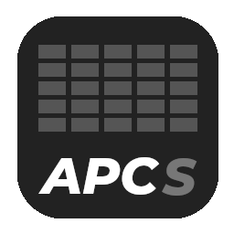

# APCSoundboard
### A wonderful soundboard program!


## Requirements
- This software
- AKAI APC Mini Mk2

> [!NOTE]
> This program does not work when no APC Mini Mk2 is connected to the computer.

## Will it work?
- **Linux Mint 22.1**: Certainly! It has been developed and tested on this distribution.
- **Other Linux distributions and Mint versions**: *not tested*
- **Windows**: Not tested, but likely not
- **macOS**: Also not tested, and likely not 

## Running
> [!TIP]
> APCSoundboard appreciates an APC Mini being plugged in *before* the program gets started, so do it now, or else you will forget it :)

Just find a suitable release for you at the Releases page. There are `AppImage`, `deb` and `rpm` files for both the x64 and arm64 architectures. If you want to run the program from source, install the required dependencies first:
```
npm install
```
and then launch the program:
```
npm start
```

## Building
If you want to make modifications to this program, you have to build the program from source. Just run the following commands:
```
sudo apt install libasound2-dev
npm install  # if not executed already
npm run build
```
and you are good to go. The produced builds can be found in the `dist` directory.

> [!IMPORTANT]
> The `libasound2-dev` system package is required to build the program because of its APC Mini (and so, MIDI-related) dependencies. The name may vary in other package managers than `apt`, but I guess it will be very similar :P

If you want to build the program for another package system or for another OS, you have to make slight modifications to the `electron-builder.yml` file. 

## Usage tips
- Keep both the host PC and the APC mini within reach. Some actions are available on only one device.
- APCSoundboard just follows the default audio output. Make sure that it is hearable (but not too loud!)

## Planned features
##### these may or may not get added in the future
- Moving/swapping pads
- Custom playback rates
- Some purpose for the faders of the APC mini
- Allowing multiple instances of one pad
